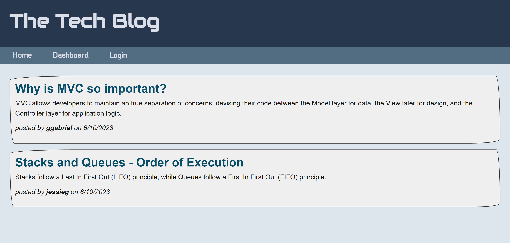

# The Tech Blog

## Table of Contents

- [Description](#description)
- [Usage](#usage)
- [Licenses](#licenses)
- [Credits](#credits)
- [Contributing](#contributing)
- [Questions](#questions)

## Description

Writing about tech can be just as important as making it. Developers spend plenty of time creating new applications and debugging existing codebases, but most developers also spend at least some of their time reading and writing about technical concepts, recent advancements, and new technologies. A simple Google search for any concept covered in this course returns thousands of think pieces and tutorials from developers of all skill levels!

This is why I have built a CMS-style blog site where developers can publish their blog posts and comment on other developers’ posts as well. This app follows the MVC paradigm in its architectural structure, using Handlebars.js as the templating language, Sequelize as the ORM, and the express-session npm package for authentication.

## Usage

The application can be accessed via this URL: https://thetechblog-ggabriel.herokuapp.com/

A user is shown the main homepage with existing posts. The user can login or signup, then from there can create new posts, delete their own posts from their dashboard page, or comment on other posts.

## Licenses

This project is covered under the MIT license. To learn more about what this means, click the license badge at the top.

## Credits

I did utilize code from codepen.io for the card borders on the homepage.

## Contributing

You are welcome to contribute to this project by forking the project or contacting me via my Github profile or email address found below in the Questions section.

## Questions

Feel free to contact me via the following links with any questions about this application.

GitHub: https://github.com/gmgabrie  
Email: ggabriel420@gmail.com
